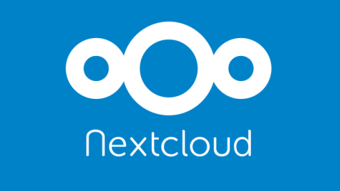
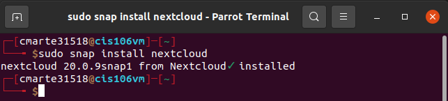
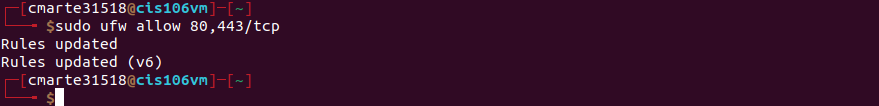
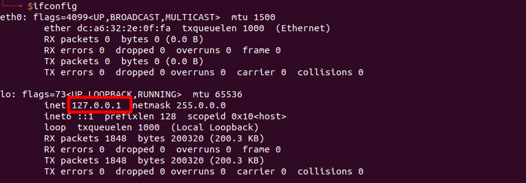
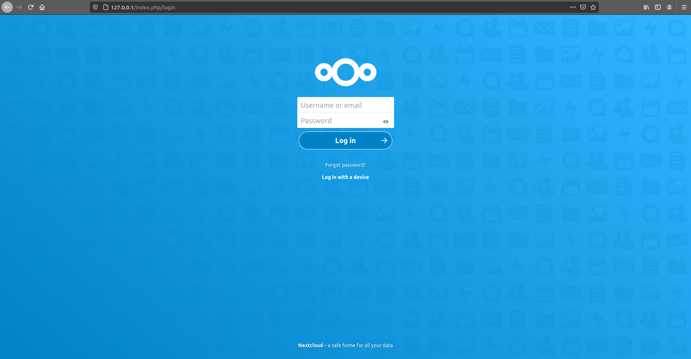

 # Building a DropBox Alternative with NextCloud 

## Table of Contents
- [Building a DropBox Alternative with NextCloud](#building-a-dropbox-alternative-with-nextcloud)
  - [Table of Contents](#table-of-contents)
  - [Project Description](#project-description)
  - [Requirements](#requirements)
  - [Installing Apache](#installing-apache)
  - [Installing NextCloud](#installing-nextcloud)
  - [Configuring and setting up Admin Account](#configuring-and-setting-up-admin-account)
  - [Accessing NextCloud](#accessing-nextcloud)
  - [Challenges](#challenges)
  - [Worked Cited](#worked-cited)

## Project Description

In this project, I am setting up a Dropbox alternative with NextCloud. This project is being done on a Raspberry Pi running the latest version of Ubuntu 20.10. 
- NextCloud is a open source app that was developed to be a great alternative for famous apps such as DropBox, GoogleDrive and more. 
- The best thing about NextCloud is that by being able to set it up the individual will have full control of the data that is being put into NextCloud. 
- In this case I set up NextCloud in my Raspberry Pi which is convenient because I can carry all my files with me at all times if necessary

## Requirements 

For this project since you will be learning how to setup NextCloud Locally all you will need:
- Linux distro (Ubuntu 20.10) Installed on any machine or Raspberry Pi
- Know your Super User password 
- Apache installed on system 
- New microSD card (Optional)
## Installing Apache

For this part you need to run only two commands
1. `sudo apt update` for updating
2. `sudo apt install apache2` for installing apache 

## Installing NextCloud 
 
For this step it is crucial to have your terminal open to run the following commands:
- To install the NextCloud snap package use `sudo snap install nextcloud` 
  - Type your password to begin installing
  - Run the command `snap changes nextcloud` to confirm the installation 

## Configuring and setting up Admin Account

The admin account is what the user will utilize to login into NextCloud when they open it locally. 
- To setup the Administrator account use `sudo nextcloud.manual-install username password`
- To see trusted domains whenever you purchase a domain name to access NextCloud from outside of the local network you can use the command `sudo nextcloud.occ config:system:get trusted_domains`
  - To add a domain to that trusted list you can use the command `sudo nextcloud.occ config:system:set trusted_domains 1 --value=nameofdomain.here`

In this part you need to run a command to open two ports on the server for accessing NextCloud on localhost. 
- `sudo ufw allow 80,443/tcp`

## Accessing NextCloud 

In this section you will need:
- Firefox running
- Machine's IP address
- Administrator's login information

>Run `ifconfig` on your terminal to find ip address 

 
>Open Firefox and type IP Address

- Type Admin's credentials and you will have access to NextCloud
- In this page you will have all the information to navigate NextCloud 

## Challenges 

- The main challenge for this project was to get all the peaces together from different resources and from things I learned in class to get to the end.
- I had a major issue with apache because at first when I installed NextCloud and created my credentials and opened the appropriate ports when I either typed my IP Address pr localhost on firefox the page was not loading and I fixed this by stopping the apache service `sudo service apache2 stop`

## Worked Cited

“NextCloud | Install and Setup on Ubuntu Server.” YouTube, YouTube, 29    Mar. 2020, www.youtube.com/watch?v=qh1w9tKtGv0. 

Nextcloud. “For Home Users.” Nextcloud, nextcloud.com/athome/. 

“Using Nextcloud for Privacy - Your Own Cloud Storage, Shared Contacts and Calendar.” YouTube, YouTube, 13 Aug. 2020, www.youtube.com/watch?v=kmYtL60qcWM. 