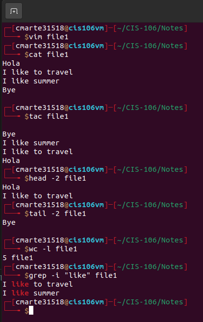
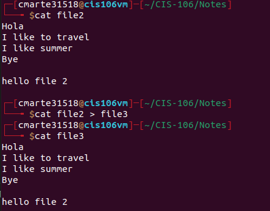

*Crismely Marte CIS 160*

## Lecture 5 Handling Text files

**Commands**
- `cat` displays the content of a file `cat + filename`
- `tac` display content in reverse `tac + filename`
- `more` displays the content of a text one page at a time `more + filename`
- `less` same as more but with files instead of text `less + filename`
- `head` display by default the top 10 number of lines of a text. It can be custome to display more or less than 10. `head + option+ filename` 
- `tail` similar to head but works with the last lines of a text
- `cut` use to get a certain section of each line of a text `cut + option + filename`
- `sort` use for sorting file such as in alphabetical order
- `wc` use for displaying the number of either lines, character and bytes
- `grep` matches a string pattern from a file
- 

**Example of some of the commands**

**I/O Redirection**
- `> or >>` use to send the content of one file to another file or a new file

**Pipe |**
- Use to separate commands 

### Basics of Nano
- to install use `sudo apt-get install nano`
- Nano is a text editor 
- to access type `nano` on terminal
- you can type without needing to press ay other keys
- To open nano and creating a new file `nano + newfilename`

**Important Keys**
- `ctrl + o` to save 
- `ctrl + x` to exit

### Basics of Vim
- To install use `sudo apt install vim`
- Vim is a great text editor 
- To use vim:
  - Open vim on terminal
    1. Click `i` to insert: this allows you to type 
    2. Click `Esc` when finish typing
    3. Click `:` to enter a command
    4. Click `q` for quitting or exiting 
    5. Click `w` to save it can be `w + filename` `wq` `wq!` 

**Important Keys**

