**Crismely Marte Final Notes**

## Table of Content
<!-- TOC -->

- [Table of Content](#table-of-content)
- [Lecture 2 Installing Ubuntu, Virtualization, and the Raspberry PI](#lecture-2-installing-ubuntu-virtualization-and-the-raspberry-pi)
    - [The Basics of Virtualization](#the-basics-of-virtualization)
        - [Hypervisor](#hypervisor)
        - [Advantages of Virtualization](#advantages-of-virtualization)
    - [Using Virtual Box](#using-virtual-box)
    - [Installing Ubuntu Virtual Machine](#installing-ubuntu-virtual-machine)
    - [Installing Ubuntu On Raspberry Pi](#installing-ubuntu-on-raspberry-pi)
    - [What is a Raspberry Pi](#what-is-a-raspberry-pi)
        - [What it is composed of](#what-it-is-composed-of)
        - [The main components you need to have a working Raspberry Pi](#the-main-components-you-need-to-have-a-working-raspberry-pi)
- [Lecture 3 Desktop Environments, Shell, Managing Software, The linux Filesystem](#lecture-3-desktop-environments-shell-managing-software-the-linux-filesystem)
    - [Desktop Environment](#desktop-environment)
    - [Shell](#shell)
- [Managing Software](#managing-software)
- [The FileSystem](#the-filesystem)
- [Lecture 4 Managing Files and Directories](#lecture-4-managing-files-and-directories)
    - [Making directories and creating empty files](#making-directories-and-creating-empty-files)
    - [Moving and coping files and directories](#moving-and-coping-files-and-directories)
    - [Wildcards](#wildcards)
    - [Brace Expansion](#brace-expansion)
- [Lecture 5 Handling Text files](#lecture-5-handling-text-files)
    - [Basics of Nano](#basics-of-nano)
    - [Basics of Vim](#basics-of-vim)
- [Lecture 6 Managing Data, File Compression & File Permission](#lecture-6-managing-data-file-compression--file-permission)
    - [Managing Data](#managing-data)
    - [File Compression](#file-compression)
    - [File Permission](#file-permission)

<!-- /TOC -->

------------------------------------------------------------------------

## Lecture 2 Installing Ubuntu, Virtualization, and the Raspberry PI ##
-----------------------------------------------------------------------

### The Basics of Virtualization 
* Virtualization is defined as a replica of hardware to simulate a virtual machine inside another computer. ( **A computer inside another computer**)
  
    * **2 Types**

        1. Server-Side Virtualization 
             Takes places on a server 
            - Example: Virtual Desktop Infrastructure (VDI) Thick Client, Thin and Zero client. 
        2. Client-Side Virtualization
            - Takes place on a client (local computer)
            - The computer running the virtualization is called **Host Comp** 
            - The virtual computer is called **Guest Comp**
            - #### Requirements  
               - Hypervisor 
               - Capable CPU minimum Dual-Core
               - RAM >= 2GB
               - Enough Storage
               - Video Graphics 128MB

#### Hypervisor

  * **2 Types** 
    1. Type 1: Runs on the computer as the actual OS by replacing the existing OS
    2. Type 2: Runs on the computer as an Application such as Virtual Box it requires your machine to run a OS before installing

#### Advantages of Virtualization
- Allows the user to test app
- Allows the user to run multiple OS
- It is less in cost
- Decreases risks by allowing user to experiment without worrying about viruses.
  
### Using Virtual Box

* VirtualBox is one of the most used type 2 Hypervisors 
  - Very popular because it run on a large range of Operating Systems
  - Could be easily installed by simply searching **VirtualBox Download** and downloading the correct extensions to enhance the performance

**VirtualBox Settings**

These images explain most of the basic VirtualBox settings

### Installing Ubuntu Virtual Machine
- First you need to search Ubuntu.com and download 
- Go to the the VM settings and go to storage and once your ubuntu package is downloaded go to Optical Drive and open the Package to automatically have ubuntu added.
- The once you open VirtualBox click on new to machine then name it.
- Choose your memory size 2GB, Create hard disk then use click dynamically allocated then for the file location and size it should be 50GB.
- Then in the settings you should customize your virtual machine then once your done the machine should be ready to start. 
- This process takes some time which is important to be detailed with all the thing your machine needs

### Installing Ubuntu On Raspberry Pi
***This is the process that i went through because I have a Raspberry Pi***
- First, before setting everything up, take the Micro SD along with the adapter and connect it to your computer
- Then download Raspberry Pi Imager
- Then you need to go to Ubuntu.com and click Raspberry PI and click Get Ubuntu for Raspberry Pi
-Then open Raspberry Pi Imager,  choose Ubuntu as the OS and then choose your memory card and press write 
- Then assure that you physically set up your Raspberry Pi and once you run it choose Ubuntu as the OS and it would take you to the OS every time you turn on your Raspberry Pi 

### What is a Raspberry Pi
- In my own words a Raspberry Pi is a mini computer that can be carried in your pocket plus all the other cables that it comes with but, it is functions good and most importantly it is cheap.

#### What it is composed of

#### The main components you need to have a working Raspberry Pi

---------------------------------------------------------------------

## Lecture 3 Desktop Environments, Shell, Managing Software, The linux Filesystem
---------------------------------------------------------------------------------
###Desktop Environment
- I basically a bunch of software running on an OS that makes up the GUI.
  - **GUI**
    - Graphical User interface 

**Some of the Linux Graphical Desktops**

**Gnome DE**
- Linux Default Desktop (Gnome 3)
- DE that is mainly made up of free and open source software
- Started in 1997 by Miguel de Icaza
- User friendly 
- Has a lot of features to make the Desktop performance and to enhance it looks

**KDE (Kool Desktop Environment)**

###Shell

**History of the Bash Shell**
- In 1969 the development of different soon to be shells begin
- Mashey Shell and Bourne Shell where the ones that the community used the most
- The free software movement shell was written by Bryan Fox
- Fox finished the shell which completed the OS for the GNU project in 1989
- Bash has become part of almost every computer in the world.

**GNOME Terminal ShortCut Commands**

**Basic & Useful Commands**

##Managing Software

**Terminology**

  - Package: Like an archive contains all the things needed to install a program
    - Library
    - Dependency
    - Repository

**Wrapper Tool**
- Makes the management of certain apps easier

**APT Package Tool**
- Makes it simple for the user to install packages
- Installs the dependencies of the app you want to install
- Allows to resume installations
- Search for packages using Local cache 
- Use for updating all packages in the system

**Installing and Updating software**

- To install just use SUDO + apt + install + package name
- To remove Sudo + apt + remove + package name

##The FileSystem

**Commands to organize files** 
- pdw: displays current directory
- cd: change directory using either Absolute or Relative Path
  - cd + destination
- ls: Displays whats inside your current directory (Long List)
1. **Absolute Path** always states the entire pathname including the root and the entire pathname to locate a certain file.
2. **Relative Path** shows the pathname to locate a file but that pathname starts from the current working directory

------------------------------------------------------------------------------

## Lecture 4 Managing Files and Directories
--------------------------------------------

### Making directories and creating empty files

**Commands**
- `mkdir`: Command use to make one or multiple directories 
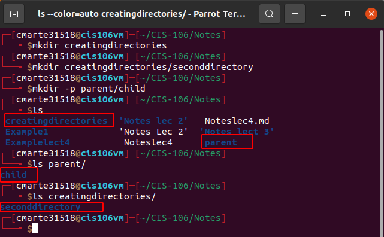
  -   mkdir -p: will make a parent directory

- `touch`: this command is use for creating empty files

- `rm`: Command use to remove files and directories

  -   rmdir: remove empty directories
  -   rm -r: this option removes directories that contains files inside which means -r is recursive.

### Moving and coping files and directories
- `mv`: command use to move and rename directories

  -   first command moved the fileex4 into another directory and renames it at the same time.
  -   Second command I move the creatingdirectories into another directory use absolute path

- `cp`: command use to copy files and directories from one place to another
- 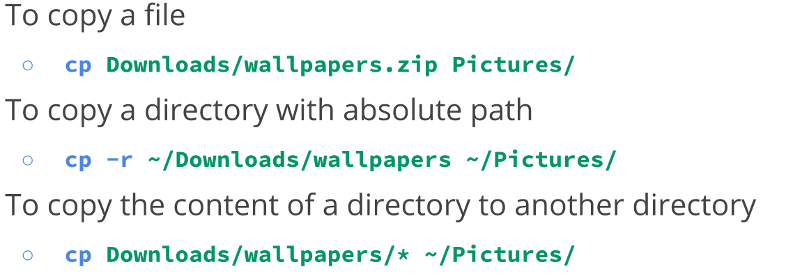

**Idone**
- all the information of a file is located there
- every file has a idone number
- to view a file's idone number use `ls -i`
- `start filename` to display idone data on file

**Hard and Soft Link**
- Hard Link
  - Like a label 
  - share same idone number
  - Points to data on hard drive
  - 2 different pathways to get to a file. Same data way
  - `In` command for hard link
- Soft Link
  - These points to Hard Link
  - Don't share same idone
  - Creates links in different hard drive
  - only leads to headlink

**Manual pages**
- can be access for every command
- its helpful for finding the best options for each command
- can be access by `man + commandname`

### Wildcards 
- `*`: matches anything or nothing for example *.txt will match all files with .txt fil extension.
- `?`: matches just one character. 

-`[]`: 
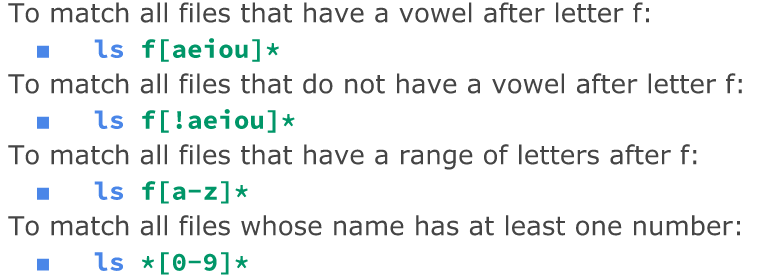
  -   `!` means to not match what was specified

### Brace Expansion

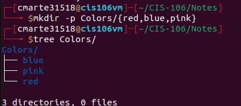

---------------------------------------------------------------------------

## Lecture 5 Handling Text files

**Commands**
- `cat` displays the content of a file `cat + filename`
- `tac` display content in reverse `tac + filename`
- `more` displays the content of a text one page at a time `more + filename`
- `less` same as more but with files instead of text `less + filename`
- `head` display by default the top 10 number of lines of a text. It can be custome to display more or less than 10. `head + option+ filename` 
- `tail` similar to head but works with the last lines of a text
- `cut` use to get a certain section of each line of a text `cut + option + filename`
- `sort` use for sorting file such as in alphabetical order
- `wc` use for displaying the number of either lines, character and bytes
- `grep` matches a string pattern from a file
- 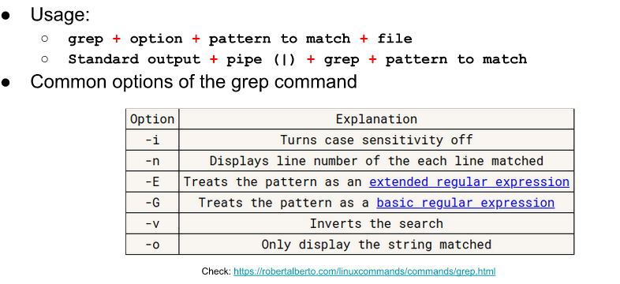

**Example of some of the commands**
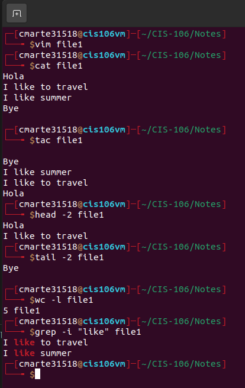

**I/O Redirection**
- `> or >>` use to send the content of one file to another file or a new file
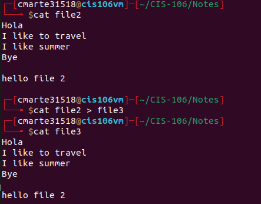

**Pipe |**
- Use to separate commands 

### Basics of Nano
- to install use `sudo apt-get install nano`
- Nano is a text editor 
- to access type `nano` on terminal
- you can type without needing to press ay other keys
- To open nano and creating a new file `nano + newfilename`

**Important Keys**
- `ctrl + o` to save 
- `ctrl + x` to exit

### Basics of Vim
- To install use `sudo apt install vim`
- Vim is a great text editor 
- To use vim:
  - Open vim on terminal
    1. Click `i` to insert: this allows you to type 
    2. Click `Esc` when finish typing
    3. Click `:` to enter a command
    4. Click `q` for quitting or exiting 
    5. Click `w` to save it can be `w + filename` `wq` `wq!` 
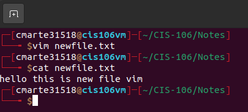

**Important Keys**
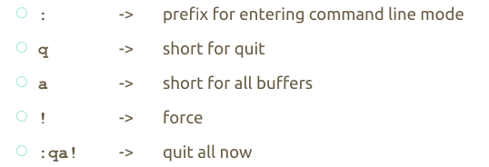

-----------------------------------------------------------------------------

## Lecture 6 Managing Data, File Compression & File Permission

### Managing Data

**Tar Command** 
- Use for creating archives by the combination of files into a single one
    - So basically with `tar` you can create a new file while also adding other file to that new archive

**Cpio Command**
- Creates, restore or copy files to create an archive
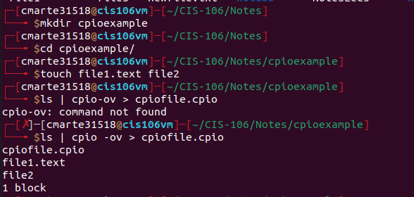

**Ar Command**
- This command simply creates, modify and extract from archives

### File Compression
- GZIP BZIP2 XZ 7Zip 

**GZIP**
- `gzip + filename` for compressing file
- `gzip -d + filename` for decompressing 

**BZIP2**
- `bzip2 + filename` for compressing
- `bzip2 -d + filename` for decompressing 

**Xz**
- `xz + filename` for compressing
- `xz -d +filename` for decompressing

They all have the similar functions for the options 
- option `k` for keeping the original file after compressing 
- option `f` for forcing compressing

After i tried compressing text files i realized that the **bzip2** compressed those text files better than bzip and xz. Yet when i tried compressing images **gzip and xz** did a better job which makes me come to the conclusion that **Bzip2** works better for text files and **Gzip, Xz** works better for images.

### File Permission

**File vs Directories**
- Files 
  - r (read) user can open and view
  - w ( write) users can open and edit
  - x ( execute) users can run
- Directories
  - r user can list content
  - w users can add or remove files 
  - x use can change directory

**Symbolic Notation example**

**Numeric Notation Example**

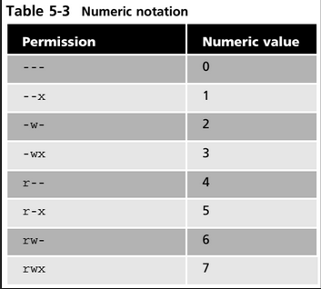