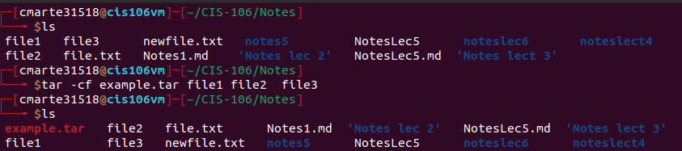
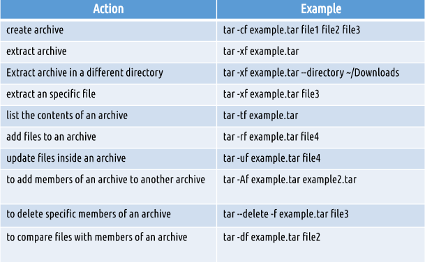
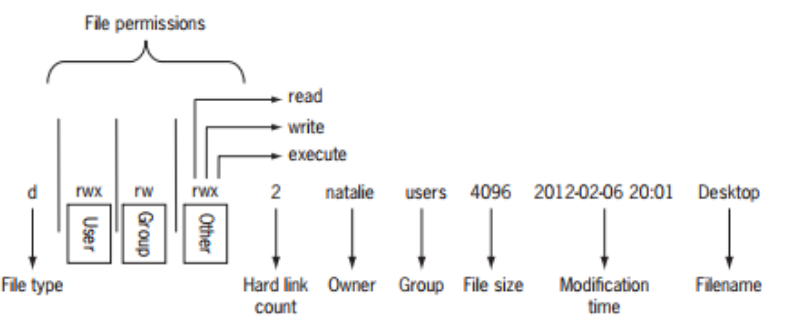

*Crismely Marte CIS 160*

## Lecture 6 Managing Data, File Compression & File Permission

### Managing Data

**Tar Command** 
- Use for creating archives by the combination of files into a single one
    - So basically with `tar` you can create a new file while also adding other file to that new archive

**Cpio Command**
- Creates, restore or copy files to create an archive

**Ar Command**
- This command simply creates, modify and extract from archives

### File Compression
- GZIP BZIP2 XZ 7Zip 

**GZIP**
- `gzip + filename` for compressing file
- `gzip -d + filename` for decompressing 

**BZIP2**
- `bzip2 + filename` for compressing
- `bzip2 -d + filename` for decompressing 

**Xz**
- `xz + filename` for compressing
- `xz -d +filename` for decompressing

They all have the similar functions for the options 
- option `k` for keeping the original file after compressing 
- option `f` for forcing compressing

After i tried compressing text files i realized that the **bzip2** compressed those text files better than bzip and xz. Yet when i tried compressing images **gzip and xz** did a better job which makes me come to the conclusion that **Bzip2** works better for text files and **Gzip, Xz** works better for images.

### File Permission

**File vs Directories**
- Files 
  - r (read) user can open and view
  - w ( write) users can open and edit
  - x ( execute) users can run
- Directories
  - r user can list content
  - w users can add or remove files 
  - x use can change directory

**Symbolic Notation example**

**Numeric Notation Example**

