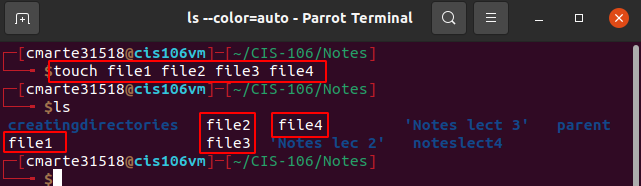
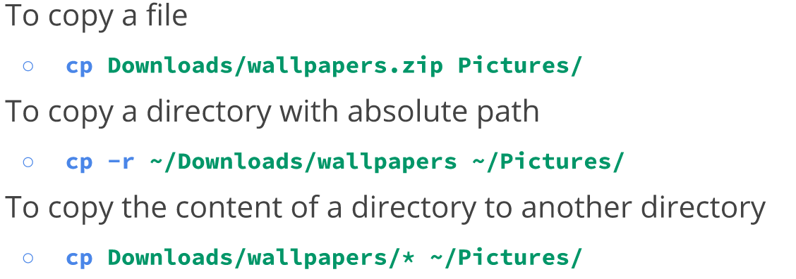

*Crismely Marte CIS 160*

## Lecture 4 Managing Files and Directories

### Making directories and creating empty files

**Commands**
- `mkdir`: Command use to make one or multiple directories 

  -   mkdir -p: will make a parent directory

- `touch`: this command is use for creating empty files

- `rm`: Command use to remove files and directories

  -   rmdir: remove empty directories
  -   rm -r: this option removes directories that contains files inside which means -r is recursive.

### Moving and coping files and directories
- `mv`: command use to move and rename directories

  -   first command moved the fileex4 into another directory and renames it at the same time.
  -   Second command I move the creatingdirectories into another directory use absolute path

- `cp`: command use to copy files and directories from one place to another
- 

**Idone**
- all the information of a file is located there
- every file has a idone number
- to view a file's idone number use `ls -i`
- `start filename` to display idone data on file

**Hard and Soft Link**
- Hard Link
  - Like a label 
  - share same idone number
  - Points to data on hard drive
  - 2 different pathways to get to a file. Same data way
  - `In` command for hard link
- Soft Link
  - These points to Hard Link
  - Don't share same idone
  - Creates links in different hard drive
  - only leads to headlink

**Manual pages**
- can be access for every command
- its helpful for finding the best options for each command
- can be access by `man + commandname`

### Wildcards 
- `*`: matches anything or nothing for example *.txt will match all files with .txt fil extension.
- `?`: matches just one character. 

-`[]`: 

  -   `!` means to not match what was specified

### Brace Expansion

