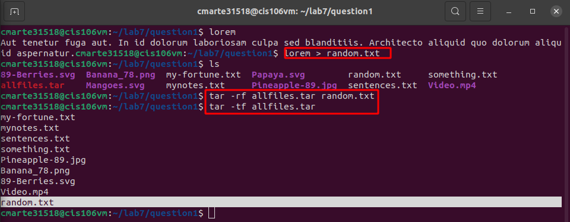

Crismely Marte

### Lab 7 Managing Files

**Question 1**

**Question 2**

**Question 3**

- After i tried compressing text files i realized that the **bzip2** compressed those text files better than bzip and xz. Yet when i tried compressing images **gzip and xz** did a better job which makes me come to the conclusion that **Bzip2** works better for text files and **Gzip, Xz** works better for images. 

**Question 4**

